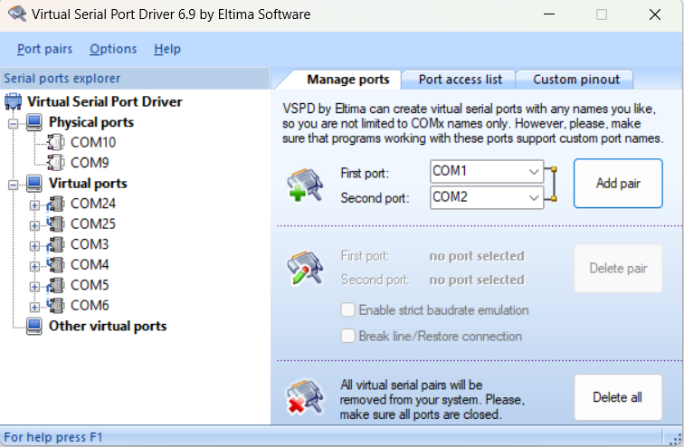
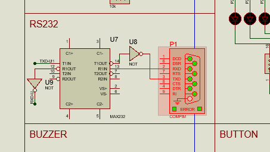
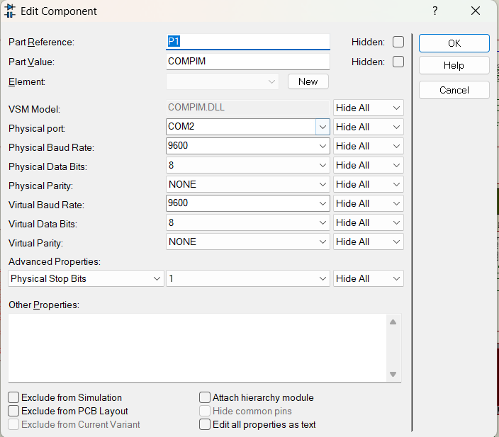
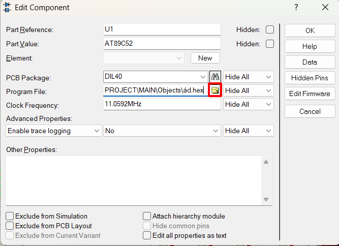
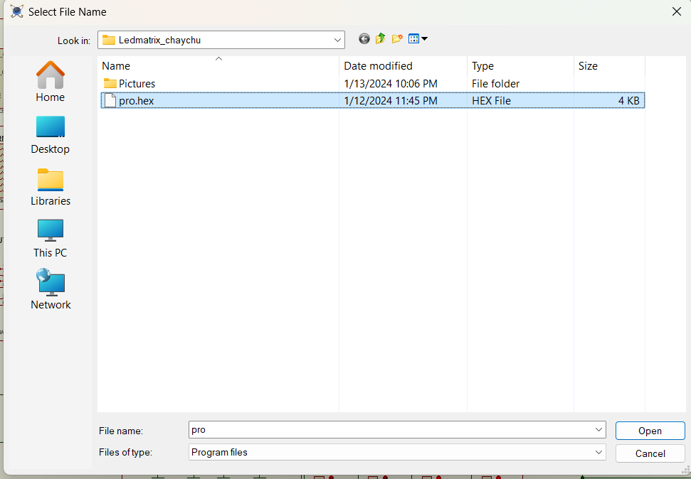

"Đang Update"
## Giới thiệu
Đề bài: Hiệu ứng chạy chữ trên Led ma trận (Chuỗi chữ gửi từ PC qua serial)

Các phần mềm sử dụng: 
+ Proteus version 8.11 
+ KeilC uVision5
+ Hercules
+ Configure virtual serial port driver

Trong đó: 
* **Configure virtual serial port driver: tạo cặp Com ảo cho việc truyền bằng serial.**
* **Hercules: là nơi gửi dữ liệu xuống vi điều khiển bằng serial**


Nhóm thực hiện:
+ Đỗ Thái Dương 21119058. SDT: 0773479706
+ Trần Xuân Kiên 21119342. SDT: 0973924182


## Hướng dẫn chạy
+ Tạo cặp COM ảo:

<p align="center">
  <br/>
  <i>Nhấn chọn vào Add pair để tạo cặp COM ảo</i>
</p>


Sources: [Link](https://www.echipkool.com/2013/05/virtual-serial-port-driver-tao-cong-noi.html)


+ Tải về chương trình:
```bash
git clone https://github.com/dothaiduongg/TT_KTMT_cuoiky.git  # clone
```
+ Mở file sơ đồ mạch:
<p align="center">
  <br/>
  <i>Chọn và double click trái vào file "TongHopProteus.pdsprj" để mở file.</i>
</p>

+ Chọn cổng COM để nhận tín hiệu Serial thông qua RS232
<p align="center">
  <br/>
  <i>Chọn và double click trái vào COMPIM.pdsprj" để mở file.</i>

</p>
<p align="center">
  <br/>
  <i>Lựa chọn cổng COM và tốc độ baud phù hợp. Chọn OK</i><br/>
</p>

+ Nạp chương trình cho Vi điều khiển.
<p align="center">
  <br/>
  <i>Chọn và double click trái vào vi điều khiển.</i>

</p>

<p align="center">
    <br/>
    <i>Chọn vào biểu tượng được khoanh đỏ.</i><br/>
</p>
<p align="center">
    <br/>
    <i>Trỏ tới thư mục vừa clone, chọn vào file "pro.hex", bấm open.</i>
</p>
<p align="center">
    <br/>
    <i>Chọn OK.</i>
</p>